# MultiIO RFID MIFARE Block Read Operation - Sequence Diagram

## Overview
This document describes the communication sequence for reading a MIFARE block via Modbus in the MultiIO RFID system.

## Sequence Diagram

```plantuml
@startuml RFID_Modbus_Communication_Sequence
!theme plain
title MultiIO RFID MIFARE Block Read Operation - Communication Sequence

participant "PC/PLC\n(Modbus Master)" as PC
participant "MultiIO Firmware\n(Modbus Slave)" as FW
participant "RFID Reader\n(UART)" as RFID

== Prerequisites ==
PC -> FW: **Modbus Write: Set Function Block 2**\nFunc: 0x06\nAddr: 1009\nValue: 0x0002
FW -> FW: Set Function Block 2\nStop continuous transmission

group FB2 Activation
    FW -> RFID: **Stop continuous mode**\n0x50 00 05 23 FF 64 00 04 00
    RFID --> FW: ACK (0x50 00 00 73)
end

FW --> PC: Modbus Response

PC -> FW: **Modbus Write: Configure Key A (optional)**\nFunc: 0x10\nAddr: 1010\nCount: 3 registers\nData: [6 bytes Key A]
FW -> FW: Store Key A internally\n(no RFID communication)
FW --> PC: Modbus Response

PC -> FW: **Modbus Write: Set Block Number & Key Select**\nFunc: 0x06\nAddr: 1016\nValue: block_num | (key_select << 8)\n[Bit 0-7: Block, Bit 8: 0=KeyA, 1=KeyB]
FW -> FW: Store block number and key selection\n(no RFID communication)
FW --> PC: Modbus Response

== MIFARE Block Read Operation ==

PC -> FW: **Modbus Read Holding Registers**\nFunc: 0x03\nAddr: 1018\nCount: 8 registers (16 bytes)

FW -> FW: Trigger RFID block read operation

group RFID Communication
    FW -> RFID: **Stop continuous mode**\n0x50 00 05 23 FF 64 00 04 00
    RFID --> FW: ACK (0x50 00 00 73)

    FW -> RFID: **MIFARE Login**\nCmd: 0x22\n0x50 00 01 22 01 00
    RFID --> FW: Login Response

    FW -> RFID: **MIFARE Authenticate**\nCmd: 0x16\nBlock sector with Key A/B
    RFID --> FW: Auth Response

    FW -> RFID: **MIFARE Read Block**\nCmd: 0x17\nBlock Nr: [block_num]\n0x50 00 01 17 [block] [crc]
    
    alt Success
        RFID --> FW: **Block Data Response**\n0x50 00 10 17 [16 bytes data] [crc]
        FW -> FW: Copy block data to buffer
    else Authentication Failed
        RFID --> FW: **Error Response**\n0xF0 00 02 16 05 [crc]
        FW -> FW: Set lastError = 0x1605
    else Read Failed  
        RFID --> FW: **Error Response**\n0xF0 00 02 17 05 [crc]
        FW -> FW: Set lastError = 0x1705
    end

    FW -> RFID: **Stop continuous mode (FB2 behavior)**\n0x50 00 05 23 FF 64 00 04 00
    RFID --> FW: ACK
end

alt Read Success
    FW --> PC: **Modbus Response**\nFunc: 0x03\n8 registers (16 bytes block data)
else Read Error
    FW --> PC: **Modbus Exception**\nException Code (device failure)
end

== Check Error Status ==

PC -> FW: **Modbus Read Register**\nFunc: 0x03\nAddr: 1026 (lastError)\nCount: 1
FW --> PC: Error code (0x0000 = success)


== Key Information ==
note right of PC
  MultiIO RFID Modbus Registers:
  - 1009: Function Block (must be 2 for MIFARE)
  - 1010-1012: Key A (3 registers, 6 bytes)
  - 1013-1015: Key B (3 registers, 6 bytes)
  - 1016: Block number + Key select
  - 1018-1025: Block data (8 regs = 16 bytes)
  - 1026: Last error code
  - 1027-1028: LED Control (FB2 only)
  
  Register 1016 Structure:
  - Low Byte (Bits 0-7): Block number (0-255)
  - High Byte Bit 0: Key select (0=A, 1=B)
  - High Byte Bits 1-7: Reserved
  
  Important Implementation Details:
  - FB2 MUST be active (1009=2) for MIFARE ops
  - Setting FB2 stops continuous transmission
  - Setting Keys/Block does NOT trigger RFID comm
  - RFID communication only on Read/Write 1018-1025
  - All MIFARE registers cause Exception if FB2 not set
  - stopContinuous called at start and end of operation
  
  RFID Operation Sequence:
  1. Stop continuous UID transmission
  2. Login to MIFARE tag (Cmd 0x22)
  3. Authenticate sector (Cmd 0x16)
  4. Read/Write block (Cmd 0x17/0x18)
  5. Stop continuous transmission (FB2 behavior)
  6. Return Modbus response or Exception
  
  UART Protocol:
  - Baud: 115200
  - Data: 8 bit
  - Parity: Even
  - Stop: 1 bit
  
  RFID Commands:
  - 0x03: LED Control
  - 0x16: MIFARE Authenticate
  - 0x17: Read MIFARE block
  - 0x18: Write MIFARE block
  - 0x22: Login/Memory Read
  - 0x23: Cyclic Send/Continuous UID read
end note

@enduml
```

## Key Points

### Prerequisites
1. **Function Block 2 must be activated** (Register 1009 = 0x0002) before any MIFARE operations
2. Setting FB2 automatically stops continuous UID transmission
3. Configure Keys A/B (optional) - stored internally, no RFID communication
4. Set Block Number and Key selection - stored internally, no RFID communication

### MIFARE Read Operation
- Triggered by reading registers 1018-1025
- Performs complete RFID communication sequence:
  - Login to MIFARE tag
  - Authenticate sector with selected key
  - Read specified block
  - Restart continuous mode
- Returns data or Modbus exception on error

### Error Handling
- Check register 1026 for last error code
- Common error codes:
  - 0x0000: Success
  - 0x16xx: Authentication failed
  - 0x17xx: Read failed

## Related Documentation
- [MultiIO RFID MIFARE Block Read Tutorial](../documentation/Modbus/MultiIO_RFID_MIFARE_Block_Read.md)
- [MultiIO RFID MIFARE Block Write Tutorial](../documentation/Modbus/MultiIO_RFID_MIFARE_Block_Write.md)
