# MultiIO RFID LED Control via Tunnel Mode (FB3) - Sequence Diagram

## Overview
This document describes the communication sequence for controlling RFID Reader LEDs via Tunnel Mode (Funktionsbaustein 3) using Modbus in the MultiIO RFID system.

## Sequence Diagram

```puml
@startuml
!theme plain
title MultiIO RFID LED Control via Tunnel Mode (FB3) - Communication Sequence

participant "PC/PLC\n(Modbus Master)" as PC
participant "MultiIO Firmware\n(Modbus Slave)" as FW
participant "RFID Reader\n(UART)" as RFID

== Prerequisites ==
PC -> FW: **Modbus Write: Set Function Block 3**\nFunc: 0x06\nAddr: 1009\nValue: 0x0003
FW -> FW: Activate Function Block 3 (Tunnel Mode)\nEnable direct UART passthrough

group FB3 Activation
    FW -> RFID: **Stop continuous mode**\n0x50 00 05 23 FF 64 00 04 00
    RFID --> FW: ACK (0x50 00 00 73)
end

FW --> PC: Modbus Response

== LED Control via Tunnel Mode ==

=== Example: Set LED to Green ===

PC -> FW: **Modbus Write Multiple Registers**\nFunc: 0x10\nAddr: 2200 (TX Buffer Start)\nCount: 5 registers\nData: [0x0008, 0x0050, 0x0303, 0x07FF, 0xA901]

note right of PC
  Tunnel TX Data Structure:
  Register 2200: TX Length = 8 bytes
  Register 2201-2204: TX Data (byte pairs)
  
  Register mapping:
  - 2200: 0x0008 (Length = 8)
  - 2201: 0x5000 (bytes: 0x50, 0x00)
  - 2202: 0x0303 (bytes: 0x03, 0x03)
  - 2203: 0x07FF (bytes: 0x07, 0xFF)
  - 2204: 0xA901 (bytes: 0xA9, 0x01)
  
  Converted to UART command:
  0x50 00 03 03 FF 07 01 A9
  
  Command breakdown:
  - 0x50: Start byte
  - 0x00: Reserved
  - 0x03: Length
  - 0x03: LED Control command
  - 0xFF: Duration (255 = permanent)
  - 0x07: LED Enable
  - 0x01: Green LED
  - 0xA9: CRC
end note

FW -> FW: Extract TX Length (8 bytes)\nExtract TX Data from registers

group Direct UART Transmission
    FW -> RFID: **LED Control Command**\n0x50 00 03 03 FF 07 01 A9
    RFID -> RFID: Activate green LED
    RFID --> FW: **ACK Response**\n0x50 00 00 73
end

FW -> FW: Store response in RX buffer\nRX Length = 4 bytes\nRX Data = 0x50 00 00 73

FW --> PC: **Modbus Response**\nFunc: 0x10\nSuccess

PC -> FW: **Modbus Read Registers**\nFunc: 0x03\nAddr: 2100 (RX Buffer Start)\nCount: 21 registers (RX Length + max RX Data)

FW --> PC: **Response Data**\n[0x0004, 0x5000, 0x0073, 0x0000, 0x0000, ...]

note right of PC
  Tunnel RX Data Structure:
  Register 2100: 0x0004 (RX Length = 4 bytes)
  Register 2101: 0x5000 (bytes: 0x50, 0x00)
  Register 2102: 0x0073 (bytes: 0x00, 0x73)
  Register 2103-2120: (unused)
  
  Received UART data:
  0x50 00 00 73
  
  IMPORTANT: Read all 21 registers (2100-2120) in one request
  since RFID response length is not known in advance.
  Use RX Length register to determine actual data length.
end note

=== Example: Set LED to Blue ===

PC -> FW: **Modbus Write Multiple Registers**\nFunc: 0x10\nAddr: 2200\nCount: 5 registers\nData: [0x0008, 0x5000, 0x0303, 0x07FF, 0xAC04]

group Direct UART Transmission
    FW -> RFID: **LED Control Command**\n0x50 00 03 03 FF 07 04 AC
    RFID -> RFID: Activate blue LED
    RFID --> FW: **ACK Response**\n0x50 00 00 73
end

FW --> PC: Modbus Response

=== Example: Turn LED Off ===

PC -> FW: **Modbus Write Multiple Registers**\nFunc: 0x10\nAddr: 2200\nCount: 5 registers\nData: [0x0008, 0x5000, 0x0303, 0x07FF, 0xA800]

group Direct UART Transmission
    FW -> RFID: **LED Control Command**\n0x50 00 03 03 FF 07 00 A8
    RFID -> RFID: Turn off all LEDs
    RFID --> FW: **ACK Response**\n0x50 00 00 73
end

FW --> PC: Modbus Response

== Key Information ==
note right of PC
  MultiIO RFID Tunnel Mode Registers:
  - 1009: Function Block (must be 3 for Tunnel Mode)
  
  TX Registers (Send to RFID):
  - 2200: TX Length (bytes to send)
  - 2201-2220: TX Data Buffer (max 40 bytes)
  
  RX Registers (Receive from RFID):
  - 2100: RX Length (bytes received)
  - 2101-2120: RX Data Buffer (max 40 bytes)
  
  Reading Strategy:
  - Always read 21 registers (2100-2120) in one request
  - RFID response length is unpredictable
  - Use register 2100 to determine actual data length
  - Ignore unused registers
  
  LED Control Command Structure:
  - Byte 0: 0x50 (Start byte)
  - Byte 1: 0x00 (Reserved)
  - Byte 2: 0x03 (Payload length)
  - Byte 3: 0x03 (LED command)
  - Byte 4: Duration (0xFF = permanent)
  - Byte 5: 0x07 (Enable LEDs)
  - Byte 6: LED Selection
    - 0x00: All LEDs off
    - 0x01: Green
    - 0x04: Blue  
    - 0x05: Cyan (Blue+Green)
  - Byte 7: CRC
  
  Important Implementation Details:
  - FB3 MUST be active (1009=3) for Tunnel Mode
  - Write to 2200 triggers immediate UART transmission
  - Must start write at register 2200 (not 2201!)
  - Maximum transmission: 40 bytes (20 registers)
  - Response available immediately after command
  
  LED Duration Values:
  - 0x01-0xFE: Duration in 50ms steps
  - 0xFF: Permanent light
  - Pause time = 500ms - light duration
  
  Other RFID Commands via Tunnel:
  - Get UID: 0x50 00 05 22 01 00 E3 19
  - Get Version: 0x50 00 05 20 00 00 21 19
  - Read Block: 0x50 00 06 17 [block] 00 [crc]
  - Sleep Mode: 0x50 00 00 0A 5A
  
  UART Protocol:
  - Baud: 115200
  - Data: 8 bit
  - Parity: Even
  - Stop: 1 bit
end note

@enduml
```

## Key Points

### Prerequisites
1. **Function Block 3 must be activated** (Register 1009 = 0x0003) to enable Tunnel Mode
2. FB3 activation stops continuous UID transmission and enables direct UART passthrough
3. All RFID commands are sent directly through the tunnel without interpretation

### Tunnel Mode Operation
- **TX Process** (PC → RFID):
  1. Write TX Length + Data to registers starting at 2200
  2. Firmware immediately forwards data to RFID via UART
  3. No data interpretation or modification by firmware

- **RX Process** (RFID → PC):
  1. RFID response stored in RX buffer automatically
  2. Read RX Length + Data from registers starting at 2100
  3. Raw UART response without modification

### LED Control Commands
- **Green LED**: `50 00 03 03 FF 07 01 A9`
- **Blue LED**: `50 00 03 03 FF 07 04 AC`
- **Cyan LED**: `50 00 03 03 FF 07 05 AD`
- **LEDs Off**: `50 00 03 03 FF 07 00 A8`

### Data Conversion
When writing to Modbus registers (16-bit), bytes must be paired in Big-Endian format:

**IMPORTANT: Modbus registers store 2 bytes each - High byte first, Low byte second**

Example for command `0x50 00 03 03 FF 07 01 A9`:
- Register 2200: 0x0008 (Length = 8 bytes)
- Register 2201: 0x5000 → bytes [0x50, 0x00]
- Register 2202: 0x0303 → bytes [0x03, 0x03]
- Register 2203: 0x07FF → bytes [0x07, 0xFF]
- Register 2204: 0xA901 → bytes [0xA9, 0x01]

The register values are formed by: (byte_n << 8) | byte_n+1

### Advantages of Tunnel Mode (FB3) over FB2
- Direct control over all RFID commands
- Access to undocumented RFID features
- Custom command sequences possible
- Raw response data available
- No firmware interpretation delays

## Related Documentation
- [RFID Modbus Specification](../documentation/Modbus/ModbusSpecRFID_Add.md)
- [RFID MIFARE Block Write Sequence](rfid_modbus_sequence_write_block.md)
- [MultiIO RFID Test GUI](Python/RfidModbusTestGUI.py)